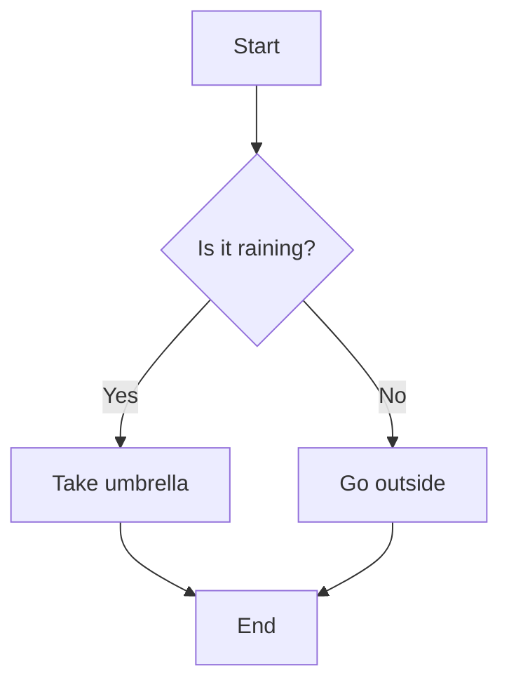

```mermaid
flowchart TD
    A[Start] --> B{Is it raining?}
    B -- Yes --> C[Take umbrella]
    B -- No --> D[Go outside]
    C --> E[End]
    D --> E[End]
```

---

### Common Mermaid Flowchart Syntax

- `A --> B` → arrow
- `A[Text]` → rectangle
- `B{Condition}` → decision (diamond)
- `C((Start/End))` → rounded node

---
