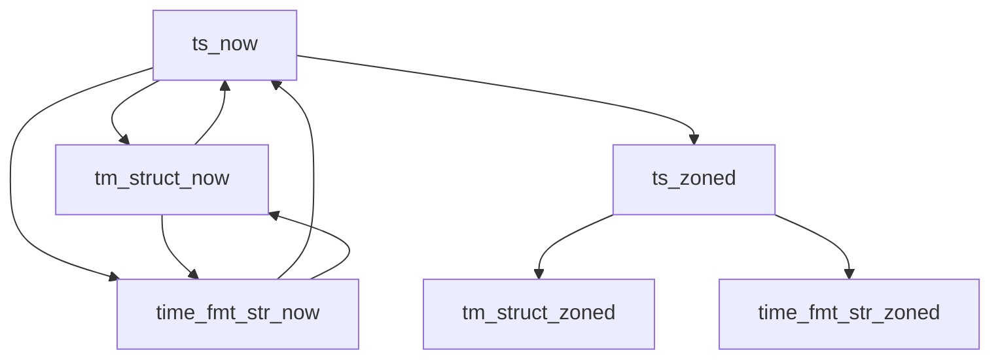

## entity
`ts` `tm_struct` `time_fmt_str`
## dimension
`now` `zoned`

```mermaid
flowchart TD
    A[ts_now] --> B[tm_struct_now]
    A --> C[time_fmt_str_now]  
    B --> C
    B --> A
    C --> A
    C --> B
    A --> D[ts_zoned]
    D --> E[tm_struct_zoned]
    D --> F[time_fmt_str_zoned]
```
