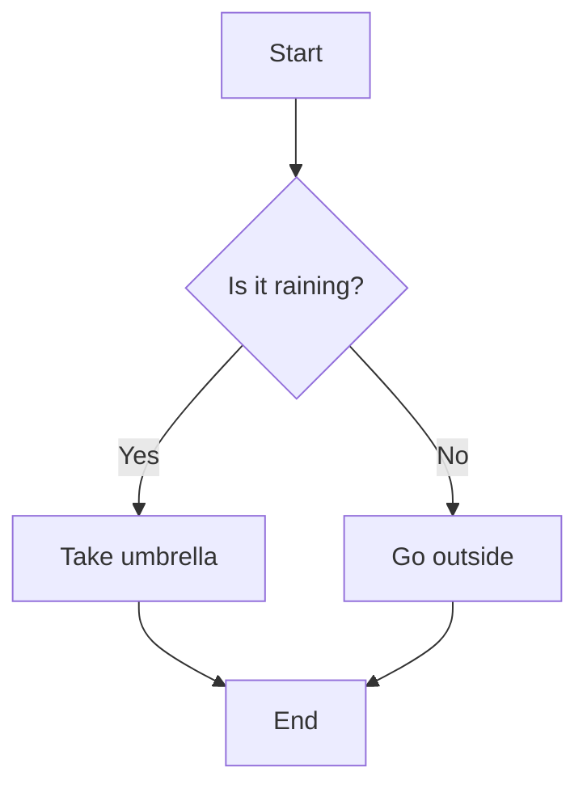

---

### Common Mermaid Flowchart Syntax

- `A --> B` → arrow
- `A[Text]` → rectangle
- `B{Condition}` → decision (diamond)
- `C((Start/End))` → rounded node

---

## entity
`timestamp` `tm_struct` `time_fmt_str`
## dimension
`now` `specific_zone`
```mermaid
flowchart time
ts_now --> tm_struct_now 
ts_now --> time_fmt_str_now  
ts_now --> ts_zoned
```
